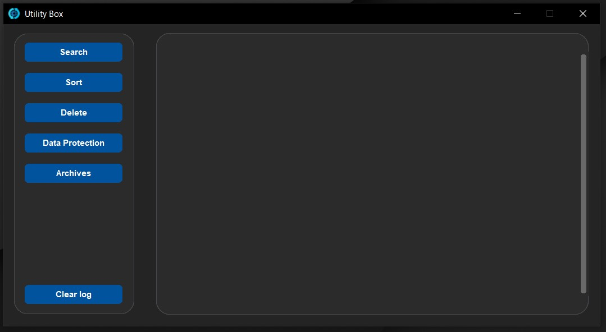
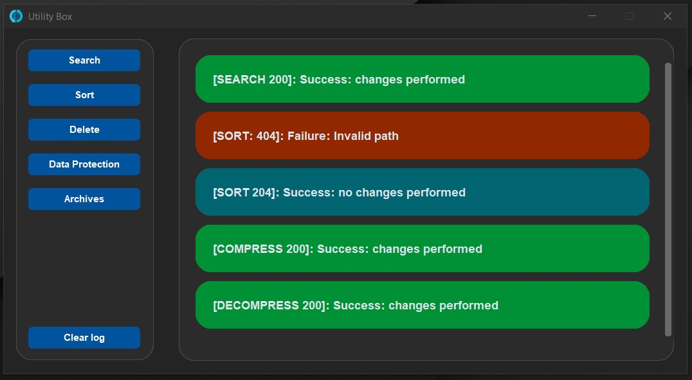
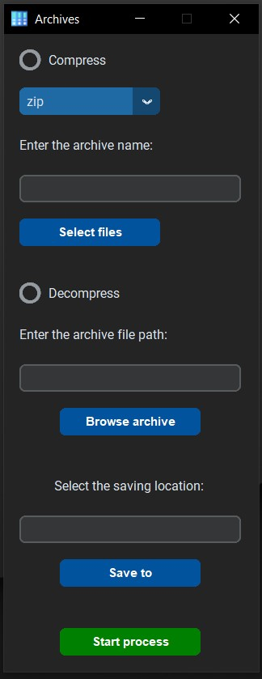
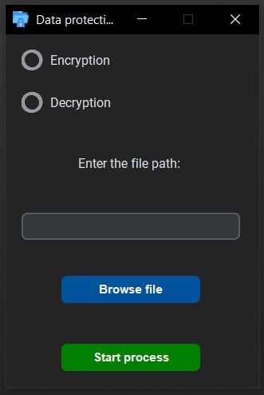
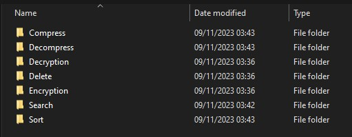
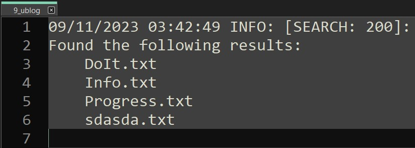
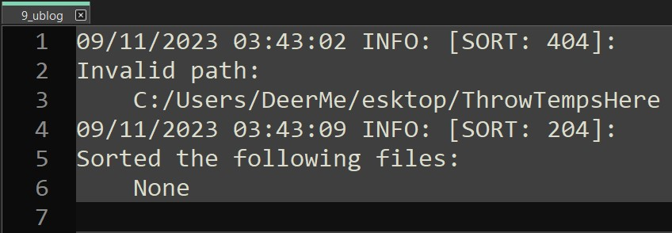

# UtilityBox

UtilityBox is a versatile collection of Python utilities designed to simplify common tasks and provide useful functionalities for developers and users. Whether you need to work with files, manage data, or perform various calculations, UtilityBox has you covered.

## Screenshots

    The application provides a simple interface with a log section attached to it, informing you about the results of the operations. 
     
    
    

     Choose between the options that will satisfy your needs. 
     
    
    

     Log files are distributed by year and operation. You can check them to see exactly which files were modified, including the time (hour, minute, and seconds). Everything is monitored and detailed to help you keep track of your operations. 
     
    
    
     
    
    

## YouTube Presentation

## Features

- Search for files based on various criteria
- Sort your files by extension, name, or provide your own naming rule
- Delete the files that are no longer needed
- Encrypt your text files and decrypt them using your special key
- Compress and decompress files with ease
- Keep track of your operations with the logs created automatically by the application

## Usage

To use UtilityBox, follow these steps:

1. Open the program
2. Select the operation that you want to use
3. Complete the parameters required for the selected operation
4. Press the Start button in the interface and enjoy the results

## Major Used Modules/Packages

- Custom Tkinter

Note: The project is developed using 'Python 3.11.3'

## Installation Guide

1. Open CMD and navigate to the desired path where the project will be located:
> cd /path/to/your/desired/directory

2. Clone the repository:
> git clone https://github.com/edg96/UtilityBox

3. Create the virtual environment:
> python -m venv venv

4. Navigate into the project directory:
> cd UtilityBox

5. Activate the virtual environment:

   - Windows:
     > venv\Scripts\activate

   - MacOS/Linux:
     > source venv/bin/activate

6. Install the necessary packages and modules from the requirements.txt:
> pip install -r requirements.txt

## License

This project is not under any specific license. It is open for public use and modification. You are free to use, modify, and distribute the code as you see fit. I look forward to any contributions, suggestions, and improvements.

Please note that while this project is open for public use, some third-party dependencies or components might be under certain license agreements.

To check the project dependencies in detail, please read the requirements text file provided in the project.

## Credits

Author: Dragos-Gabriel Enache

Maintainer: Dragos-Gabriel Enache

Email: edragosgabriel@gmail.com

GitHub: https://github.com/edg96

Status: Development (the basic version is finished, improvements, and new functionalities might come in the future)
